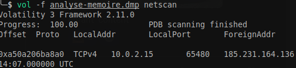
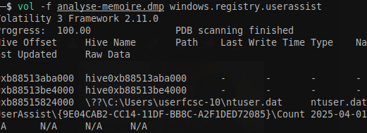
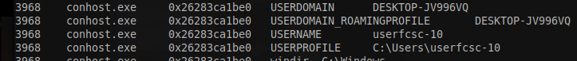

#  Analyse mémoire - Pour commencer (1/2) 


```
vol -f analyse-memoire.dmp netscan
```




```
vol -f analyse-memoire.dmp windows.registry.userassist
```


```
vol -f analyse-memoire.dmp windows.envars.Envars
```



FCSC{userfcsc-10:DESKTOP-JV996VQ:10.0.2.15}
