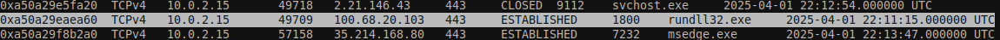
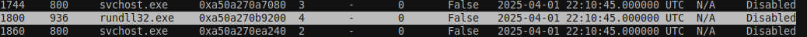

#  Analyse mémoire 1/5 - Exfiltration 

Using [volatily3](https://github.com/volatilityfoundation/volatility3)

[Medium](https://medium.com/@ameenovv/windows-memory-forensics-writeup-dumpme-b2860d7a138f)


Running first netscan to check the connection:
```
vol -f analyse-memoire.dmp windows.netscan
```

My first suspiscion was rundll32.exe making connection as it is the runned process that should the least make a connection.




After that I made a pslist scan to get its pid 
```
vol -f analyse-memoire.dmp windows.pslist.Pslist
```



And so the flag was:

```
FCSC{rundll32.exe:1800:100.68.20.103:443:TCP}
```