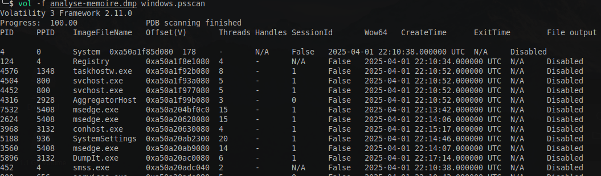
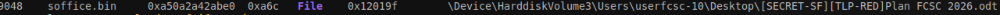

#  Analyse mémoire - Pour commencer (2/2) 

So first I scanned the process to get their pid:
```
vol -f analyse-memoire.dmp windows.psscan
```


Then I mnaully scanned multiple handles and the process I suspected related with their pid.


```
vol -vf analyse-memoire.dmp windows.handles --pid 7184 | grep -i "file"
```
```
 vol -vf analyse-memoire.dmp windows.handles --pid 8968 | grep -i "file"
```
```
vol -vf analyse-memoire.dmp windows.handles --pid 8492 | grep -i "file"
```

And it was actually soffice.bin
```
vol -vf analyse-memoire.dmp windows.handles --pid 9048 | grep -i "file"

```



Flag:
```
FCSC{soffice.bin:[SECRET-SF][TLP-RED]Plan FCSC 2026.odt}
```

