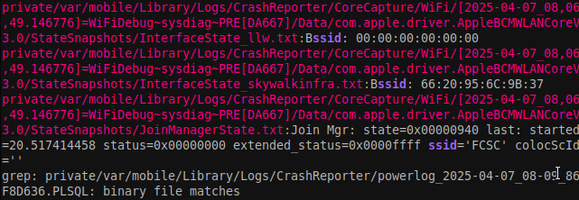

# iForensics - iWiFi 

a simple grep for ssid:

```
grep -rs "ssid"
```


Bssid: 66:20:95:6C:9B:37

ssid='FCSC'

And for the account i made a [small python script](./find_icloud.py) to find for all the possible acount and as the iphone is owned by robert, we can see that while just a ``grep "iphone"`` over the files.

From all the possible accunt it is then:
robertswigert@icloud.com

FCSC{FCSC|66:20:95:6C:9B:37|robertswigert@icloud.com}

